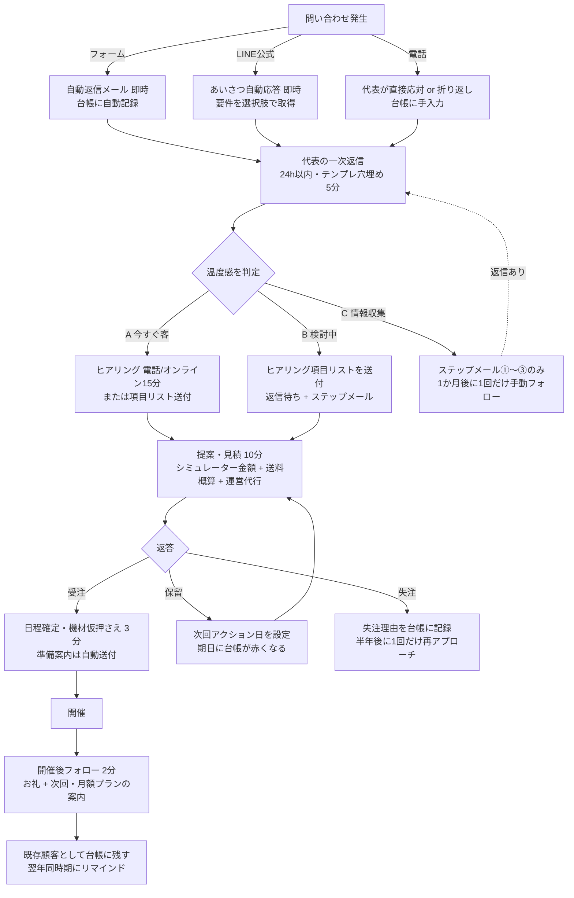

# 追客フロー設計 — 問い合わせから開催後フォローまで

> 営業担当AIのドラフト（社内文書 / L0）。顧客への送信・条件提示は対外行為（L2）のため、
> 実際に動かす前に竹村代表の承認が必要。「要確認」の項目は代表判断待ち。

## 0. 設計の狙い

- **代表の手作業は1件あたり合計30分以内**（今すぐ客で約28分、検討中で約17分、情報収集で約5分）。
- 「受付確認・情報提供・リマインド」は自動化し、代表は**判断と会話だけ**に集中する。
- 問い合わせフォーム（自前PHP・自動返信・スプレッドシート記録）とLINE公式が起点。台帳は `lead-sheet-template.csv` / `lead-sheet-guide.md` の形式。
- **すでにある実装との整合**：`site/contact.php` が受信→代表宛通知→自動返信（`site/mail-templates/autoreply.txt`、「1営業日以内にご連絡」）→GASウェブアプリへJSON POST（datetime / purpose / plan / company / name / email / content / message / referer / autoreply_sent）まで行う。GASの受け口とスプレッドシート「リード台帳」の作成は `docs/ops/setup-checklist.md` No.6、LINE公式の開設と応答文面は同 No.5 / `docs/setup/line.md`（プロダクト担当作成予定）。本フローはこの上に乗る。
- HP（`site/index.html`）の記載と整合：料金は機材レンタル費（税別）／運営代行は個別見積／送料は実費／相談目安は開催1か月前／土日中心稼働／自社運営可（手順書・マニュアル・オンライン説明）。

## 1. 全体図

## 2. ステップ別：自動でやること／代表が手でやること／ツール

| # | ステップ | 自動でやること | 代表が手でやること（所要時間） | 使うツール |
|---|---|---|---|---|
| 1 | 問い合わせ発生 | フォーム送信をスプレッドシートに1行追加（受付日時・流入経路=フォーム・会社名・担当者名・メール・ご用件・希望プラン・希望の体験・本文）。ステータスは「新規」、自動返信済み=済 | なし（LINE・電話の場合のみ台帳へ手入力 2分） | 自前PHP / スプレッドシート / LINE公式 |
| 2 | 自動返信（即時） | 受付確認・返信目安（**1営業日以内**・既存の autoreply.txt の表現に合わせる）・急ぎの場合の電話番号を送信。料金表とFAQへのリンク追記を提案（`step-mails.md` 第0章）。差出人 data@nextvision.fun | なし | PHP（`site/contact.php`）／LINE公式のあいさつメッセージ |
| 3 | 代表の一次返信（1営業日以内・A客は当日中） | 「新規」のまま12時間経過した行を黄色表示（条件付き書式）。朝9:30に未対応リードの一覧を通知（要確認：GASかメール通知か） | 台帳を見て**温度感を判定**し、一次返信テンプレを穴埋めして送信。台帳のステータスを「対応中」、温度感、次回アクション日を入力（**5分**） | Gmail / LINE公式 / 台帳 / `step-mails.md` のテンプレ |
| 4 | ヒアリング | 一次返信にヒアリング項目リストを同梱（返信で埋めてもらう）。返信が無ければステップメール①〜③が翌日・3日後・7日後に自動送信。返信があった時点でステップメールは停止 | 今すぐ客のみ電話またはオンラインで15分（**A客 15分**／B・C客は**0分**、テキスト回答を読むだけ） | 電話 / Google Meet / LINE通話 / 台帳 |
| 5 | 提案・見積 | 見積シミュレーターの金額（機材費）＋2日目以降50%目安（HP記載）で機材費が出る。送料は会場所在地からの概算表（要作成：地域別の目安表）を引く | 見積テンプレに機材費・送料概算・運営代行（人数×時間）を記入して送付。会場図面があれば配置案を一言添える。ステータス「見積提出」、次回アクション日=送付の5営業日後（**10分**） | 見積テンプレ（要確認：既存のものがあるか）/ Gmail / 台帳 |
| 6 | 日程確定 | 受注に変えると準備案内（搬入時間・電源・動線・保険証明書の要否・雨天時切替の確認）が自動送付（要確認：GASで自動化するか、テンプレ手送りにするか） | 機材の仮押さえをカレンダーに登録、契約書または発注書の取り交わし。ステータス「受注」（**3分**） | Googleカレンダー / 契約書テンプレ / 台帳 |
| 7 | 開催 | 前日にリマインド（搬入時間・緊急連絡先）を自動送付 | 当日運営（このフローの対象外） | — |
| 8 | 開催後フォロー | 開催翌営業日にお礼メールを自動送付（写真提供のお願い・掲載許可の確認・次回とエア遊具月額プランの案内）。台帳の「次回アクション日」を翌年の同時期−2か月に自動設定 | 担当者からの返信に一言返す。掲載許可が取れたら台帳に記録（**2分**） | Gmail / 台帳 |

**代表の合計作業時間（1件あたり）**

| 温度感 | 一次返信 | ヒアリング | 見積 | 日程確定 | 開催後 | 合計 |
|---|---|---|---|---|---|---|
| A 今すぐ客 | 5分 | 15分 | 10分 | 3分 | 2分 | **約35分**（商談化するので許容。電話ヒアリングをテキスト回答に置き換えれば約20分） |
| B 検討中 | 5分 | 0分（テキスト回答） | 10分 | 3分 | 2分 | **約20分** |
| C 情報収集 | 5分（一次返信のみ） | 0分 | 0分 | — | — | **約5分**（残りは自動） |

> 30分を超えるのはA客の電話ヒアリングを含む場合のみ。A客は受注確度が高いので、ここは代表の時間を使う価値があると判断した。

## 3. 流入経路別の分岐

| 経路 | 初動（自動） | 代表がやること | 注意点 |
|---|---|---|---|
| **フォーム**（メイン） | PHPが代表宛に通知メール、送信者に自動返信、GAS経由で台帳へ記録 → ステップメールの予約 | 1営業日以内に一次返信（メール。代表宛通知メールに返信すると送信者に届く仕様なので、通知メールから直接返信するのが最短）。ご用件が「見積依頼」「開催の相談」で日程・会場が書いてあればA客扱い | 現行フォームには**電話番号欄がない**（`site/index.html` の `#inquiry`）。任意で追加をプロダクト担当に依頼（`proposals.md` 参照） |
| **LINE公式** | あいさつメッセージで「①開催の相談 ②資料がほしい ③見積がほしい ④その他」を選択肢（クイックリプライ）で取得。応答時間外は「平日9:30-18:00に返信します」を自動送信 | 台帳に手入力（2分）→ LINE用一次返信テンプレで返信。LINEは短文で往復が速いので、ヒアリング項目は**2〜3問ずつ小分け**に送る | LINEの顧客はメールアドレスが取れないことが多い。見積送付時にメールアドレスを聞き、以後の正式書類はメールに寄せる |
| **電話** | 営業時間外は留守番電話で「メールかLINEでのご連絡をお願いします」＋番号案内（要確認：留守電メッセージの設定） | 出られたらその場でヒアリング項目を聞く（10〜15分）。出られなければ折り返し。通話後に台帳へ手入力し、**確認メールを送って文字に残す**（一次返信テンプレを流用） | 電話のみで進めると記録が残らない。必ずメールまたはLINEに合流させる |

## 4. 温度感の判定基準と対応方針

| 温度感 | 判定基準（いずれか複数に該当） | 対応方針 | 一次返信の期限 | 次回アクション日の目安 |
|---|---|---|---|---|
| **A 今すぐ客** | 開催予定日が3か月以内で具体的（月＋曜日など）／会場名・広さが書いてある／ご用件が「見積依頼」／「運営代行込み」を選択／電話での問い合わせ | 当日中に一次返信し、電話またはオンラインの15分ヒアリングを提案（候補日時を2〜3つ提示）。ヒアリング当日〜翌営業日に見積を出す | 当日中（営業時間外の受付は翌営業日の午前） | 見積送付から3営業日後 |
| **B 検討中** | 時期はあるが未確定（「秋ごろ」「来期」）／上司や本部への説明資料が欲しい／「機材のみ」か「運営代行込み」か迷っている／予算感の質問 | 24h以内に一次返信＋ヒアリング項目リストを送付。ステップメール①〜③で「上司に説明しやすい材料」を渡す。回答が来たら概算見積を出す | 24h以内 | 一次返信から7日後（ステップメール③の翌日） |
| **C 情報収集** | ご用件が「資料請求」「写真素材の請求」／時期・会場ともに未定／学生・個人・同業者と思われる | 一次返信は短く（資料＝HPの料金表・FAQ・各商材ページへの導線）。以後はステップメールに任せる。1か月後に1回だけ「その後いかがですか」を手動で送り、反応がなければステータスを「休眠」に | 24h以内（テンプレのまま送る） | 一次返信から30日後 |

**温度感の見直しルール**：返信内容で上げ下げする（例：C客が「11月の土日で」と返信してきたらAへ）。台帳の温度感は最新の判断で上書きしてよい。

## 5. ステップメールの運用ルール

- 対象：温度感B・Cで、一次返信への返信がない相手。A客も、ヒアリング日程が決まらなければ対象に含める。
- 送信タイミング：問い合わせの翌日（①）、3日後（②）、7日後（③）。営業時間内（10:00前後）に送る。
- **停止条件**：相手から返信があった／見積提出済み／受注・失注／配信停止の申し出。台帳の「ステップメール進捗」を「停止」にすると送らない。
- 送信手段（要確認）：スプレッドシートのGoogle Apps Script（時間トリガーで台帳を見て送信）が最も簡単で、代表のGmailから送れる。PHP側のcronで送る案もあるが、台帳との整合を考えるとGASを推奨。
- 文案は `step-mails.md`。

## 6. 台帳の毎朝ルーティン（代表・3分）

1. 台帳を開く。赤い行（次回アクション日が今日以前で未完了）と黄色い行（新規のまま12時間超）を見る。
2. 赤い行：次のアクション（返信・フォロー・見積）を実行し、次回アクション日を更新。
3. 黄色い行：一次返信テンプレで返信。
4. 終わったらステータスを進める。それ以外の行は触らない。

## 7. 要確認（代表判断が必要なもの）

| 項目 | 内容 |
|---|---|
| 返信期限 | 既存の自動返信は「1営業日以内」。本フローもそれに合わせた。A客だけ「当日中」を社内目標にするかは代表判断（対外的な約束にはしない） |
| A客への電話ヒアリング | 代表が電話・オンラインに出る時間帯（例：平日10:00-12:00 / 14:00-17:00）を決めておくと、候補日時をテンプレに固定できる |
| 送料の概算表 | 地域別（近畿／中部・中国／関東・四国・九州／北海道・東北・沖縄）の目安額。HPは「実費・見積時は概算」なので、概算の根拠表が必要 |
| 見積・契約書のテンプレ | 既存があれば流用。なければ業務管理担当に作成依頼 |
| 通知・自動送信の実装 | 台帳の朝通知、ステップメール、受注時の準備案内、開催後お礼メールをGASで自動化するか（プロダクト担当に依頼） |
| 留守電メッセージ／LINE応答時間外メッセージ | 文言と設定 |
| 掲載許可の取り方 | 開催後フォローで写真提供・施設名掲載の許可を聞く文言（取引先社名は非掲載ポリシーのため、「施設カテゴリのみ掲載」で聞くか） |
